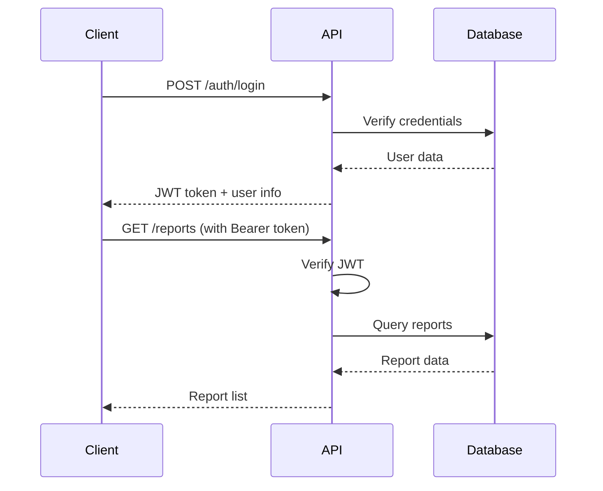

# SIPA API Documentation

**Version:** 1.0.0  
**Base URL:** `https://your-backend.onrender.com/api`  
**Environment:** Production

---

## Table of Contents

1. [Authentication](#authentication)
2. [Reports](#reports)
3. [Users](#users)
4. [Metadata](#metadata)
5. [Error Codes](#error-codes)

---

## Authentication

### Login

**POST** `/auth/login`

Authenticate user and receive JWT token.

**Request Body:**
```json
{
  "username": "string",
  "password": "string"
}
```

**Response:** `200 OK`
```json
{
  "token": "eyJhbGciOiJIUzI1NiIsInR5cCI6IkpXVCJ9...",
  "user": {
    "id": "string",
    "username": "string",
    "fullName": "string",
    "role": "admin | appraiser | supervisor",
    "email": "string"
  }
}
```

**Error:** `401 Unauthorized`
```json
{
  "error": "Kredensial tidak valid"
}
```

---

### Get Current User

**GET** `/auth/me`

Get currently authenticated user information.

**Headers:**
```
Authorization: Bearer {token}
```

**Response:** `200 OK`
```json
{
  "id": "string",
  "username": "string",
  "fullName": "string",
  "role": "admin | appraiser | supervisor",
  "email": "string",
  "phone": "string"
}
```

---

## Reports

### List All Reports

**GET** `/reports`

Retrieve list of all reports (filtered by role).

**Headers:**
```
Authorization: Bearer {token}
```

**Query Parameters:**
- `status` (optional): Filter by status (`draft`, `submitted`, `for_review`, `approved`, `rejected`)
- `assignedAppraiserId` (optional): Filter by appraiser
- `limit` (optional): Number of results (default: 50)
- `offset` (optional): Pagination offset (default: 0)

**Response:** `200 OK`
```json
[
  {
    "id": "string",
    "reportNumber": "SIPA-2024-0001",
    "status": "draft | submitted | for_review | approved | rejected",
    "createdAt": "2024-12-12T00:00:00Z",
    "updatedAt": "2024-12-12T00:00:00Z",
    "assignedAppraiserId": "string",
    "generalInfo": {
      "customerName": "string",
      "loanAmount": 0,
      "reportNumber": "string"
    }
  }
]
```

---

### Get Report by ID

**GET** `/reports/:id`

Retrieve specific report details.

**Headers:**
```
Authorization: Bearer {token}
```

**Response:** `200 OK`
```json
{
  "id": "string",
  "reportNumber": "SIPA-2024-0001",
  "status": "string",
  "createdAt": "2024-12-12T00:00:00Z",
  "updatedAt": "2024-12-12T00:00:00Z",
  "assignedAppraiserId": "string",
  "generalInfo": {
    "customerName": "string",
    "customerAddress": "string",
    "loanAmount": 0,
    "reportNumber": "string",
    "reportDate": "2024-12-12",
    "appraisalDate": "2024-12-12"
  },
  "valuationInput": {
    "landArea": 0,
    "buildingArea": 0,
    "njopLandPerM2": 0,
    "njopBuildingPerM2": 0,
    "marketLandPricePerM2": 0,
    "safetyMarginPercent": 0,
    "liquidationFactorPercent": 0
  },
  "valuationResult": {
    "landValue": 0,
    "buildingValue": 0,
    "marketValue": 0,
    "liquidationValue": 0,
    "recommendedLoanValue": 0
  }
}
```

**Error:** `404 Not Found`
```json
{
  "error": "Laporan tidak ditemukan"
}
```

---

### Create Report

**POST** `/reports`

Create new appraisal report.

**Headers:**
```
Authorization: Bearer {token}
Content-Type: application/json
```

**Request Body:**
```json
{
  "generalInfo": {
    "customerName": "string",
    "customerAddress": "string",
    "loanAmount": 0,
    "reportDate": "2024-12-12",
    "appraisalDate": "2024-12-12"
  },
  "valuationInput": {
    "landArea": 100,
    "buildingArea": 80,
    "njopLandPerM2": 500000,
    "njopBuildingPerM2": 800000,
    "marketLandPricePerM2": 600000,
    "safetyMarginPercent": 10,
    "liquidationFactorPercent": 80
  }
}
```

**Response:** `201 Created`
```json
{
  "id": "string",
  "reportNumber": "SIPA-2024-0001",
  "status": "draft",
  "createdAt": "2024-12-12T00:00:00Z"
}
```

**Error:** `400 Bad Request`
```json
{
  "error": "Validasi gagal",
  "details": [
    "NJOP Tanah harus antara Rp 1,000 - Rp 100,000,000 per m²",
    "Luas tanah harus minimal 1 m²"
  ]
}
```

---

### Update Report

**PUT** `/reports/:id`

Update existing report.

**Headers:**
```
Authorization: Bearer {token}
Content-Type: application/json
```

**Request Body:** Same as Create Report

**Response:** `200 OK`
```json
{
  "id": "string",
  "reportNumber": "SIPA-2024-0001",
  "status": "string",
  "updatedAt": "2024-12-12T00:00:00Z"
}
```

**Error:** `403 Forbidden`
```json
{
  "error": "Hanya penilai yang ditugaskan yang dapat mengubah laporan"
}
```

---

### Delete Report

**DELETE** `/reports/:id`

Delete report (draft only).

**Headers:**
```
Authorization: Bearer {token}
```

**Response:** `204 No Content`

**Error:** `400 Bad Request`
```json
{
  "error": "Hanya laporan draft yang dapat dihapus"
}
```

---

### Download Report PDF

**GET** `/reports/:id/pdf`

Generate and download report as PDF.

**Headers:**
```
Authorization: Bearer {token}
```

**Response:** `200 OK`
```
Content-Type: application/pdf
Content-Disposition: attachment; filename="SIPA-2024-0001.pdf"
```

---

### Submit Report for Review

**POST** `/reports/:id/submit`

Submit draft report for review.

**Headers:**
```
Authorization: Bearer {token}
```

**Response:** `200 OK`
```json
{
  "id": "string",
  "status": "submitted",
  "updatedAt": "2024-12-12T00:00:00Z"
}
```

---

### Approve/Reject Report

**POST** `/reports/:id/approve`
**POST** `/reports/:id/reject`

Approve or reject submitted report.

**Headers:**
```
Authorization: Bearer {token}
Content-Type: application/json
```

**Request Body (for reject):**
```json
{
  "reason": "string"
}
```

**Response:** `200 OK`
```json
{
  "id": "string",
  "status": "approved | rejected",
  "updatedAt": "2024-12-12T00:00:00Z"
}
```

---

## Users

### List Users

**GET** `/users`

Get all users (admin only).

**Headers:**
```
Authorization: Bearer {token}
```

**Response:** `200 OK`
```json
[
  {
    "id": "string",
    "username": "string",
    "fullName": "string",
    "role": "admin | appraiser | supervisor",
    "email": "string",
    "phone": "string",
    "createdAt": "2024-12-12T00:00:00Z"
  }
]
```

---

### Create User

**POST** `/users`

Create new user (admin only).

**Headers:**
```
Authorization: Bearer {token}
Content-Type: application/json
```

**Request Body:**
```json
{
  "username": "string",
  "password": "string",
  "fullName": "string",
  "role": "admin | appraiser | supervisor",
  "email": "user@example.com",
  "phone": "081234567890"
}
```

**Response:** `201 Created`
```json
{
  "id": "string",
  "username": "string",
  "fullName": "string",
  "role": "string"
}
```

---

### Update User

**PUT** `/users/:id`

Update user information.

**Headers:**
```
Authorization: Bearer {token}
Content-Type: application/json
```

**Request Body:**
```json
{
  "fullName": "string",
  "email": "user@example.com",
  "phone": "081234567890"
}
```

**Response:** `200 OK`

---

### Delete User

**DELETE** `/users/:id`

Delete user (admin only).

**Headers:**
```
Authorization: Bearer {token}
```

**Response:** `204 No Content`

---

## Metadata

### Get Building Standards

**GET** `/meta/building-standards`

Retrieve all building standards and depreciation rules.

**Headers:**
```
Authorization: Bearer {token}
```

**Response:** `200 OK`
```json
{
  "buildingStandards": [
    {
      "code": "house_one_story_type_a",
      "name": "Bangunan Satu Lantai Rumah/Ruko Type A",
      "floors": 1,
      "category": "rumah_ruko",
      "baseRate": 2900000,
      "specification": ["..."]
    }
  ],
  "depreciationRules": [
    {
      "minAge": 0,
      "maxAge": 5,
      "percent": 5
    }
  ]
}
```

---

## Error Codes

### HTTP Status Codes

| Code | Description |
|------|-------------|
| 200 | Success |
| 201 | Created |
| 204 | No Content |
| 400 | Bad Request - Validation error |
| 401 | Unauthorized - Invalid/missing token |
| 403 | Forbidden - Insufficient permissions |
| 404 | Not Found |
| 429 | Too Many Requests - Rate limit exceeded |
| 500 | Internal Server Error |

### Common Error Messages

**Validation Errors:**
- `"NJOP Tanah harus antara Rp 1,000 - Rp 100,000,000 per m²"`
- `"Luas tanah harus minimal 1 m²"`
- `"Safety margin harus antara 0-100%"`
- `"Faktor likuidasi harus antara 0-100%"`

**Authentication Errors:**
- `"Kredensial tidak valid"`
- `"Token tidak valid atau kadaluarsa"`
- `"Tidak diizinkan"`

**Authorization Errors:**
- `"Hanya admin yang dapat mengakses"`
- `"Hanya penilai yang ditugaskan yang dapat mengubah laporan"`

---

## Rate Limiting

**Limits:**
- 100 requests per 15 minutes per IP
- Login: 5 attempts per 15 minutes per IP

**Headers:**
```
X-RateLimit-Limit: 100
X-RateLimit-Remaining: 95
X-RateLimit-Reset: 1702380000
```

---

## Pagination

For list endpoints that support pagination:

**Query Parameters:**
- `limit`: Number of items per page (default: 50, max: 100)
- `offset`: Number of items to skip (default: 0)

**Response Headers:**
```
X-Total-Count: 150
X-Page-Size: 50
X-Page-Offset: 0
```

---

## Authentication Flow



---

## Example Usage

### JavaScript/TypeScript

```typescript
// Login
const loginResponse = await fetch('https://api.example.com/api/auth/login', {
  method: 'POST',
  headers: {
    'Content-Type': 'application/json',
  },
  body: JSON.stringify({
    username: 'appraiser',
    password: 'password123',
  }),
});

const { token, user } = await loginResponse.json();

// Get reports
const reportsResponse = await fetch('https://api.example.com/api/reports', {
  headers: {
    'Authorization': `Bearer ${token}`,
  },
});

const reports = await reportsResponse.json();
```

---

**© 2025. Izhan Project**  
**Last Updated:** 2024-12-12
